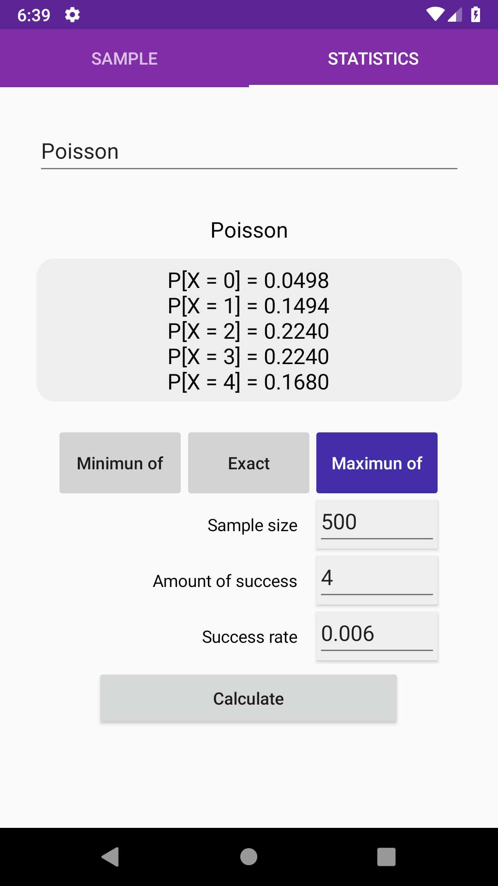
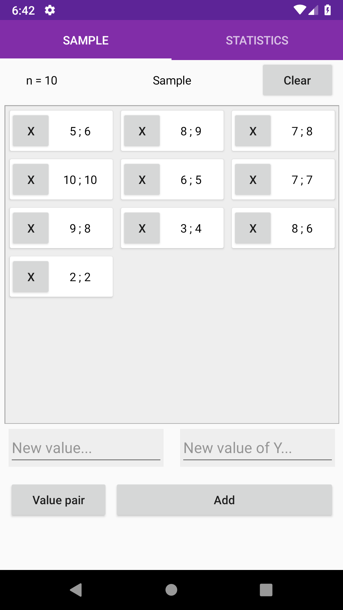

# Statistics calculator
> Mobile statistics calculator app

#### Leia em [português](./LEIAME.md)

# Table of Content
- [Why?](#why?)
- [Installers](#installers)
- [Features](#features)
- [Getting started](#getting-started)
- [Contribute](#contribute)
- [Statistics Class](./StatisticsCore/)

# Why?
This app is part of my personal portfolio, so i would be grateful for any feedback about the project, code, concepts or other aspect. Also i need a calculator to statistics class.

# Installers
The android installer (5.0 Lolipop ~ 9.0 Pie) can be found [here](https://drive.google.com/open?id=1GyfaEhdp7MEbBXaw7EFToQjcOojnAKMX).

As to iOS installer, no schedule.

# Features
- [x] Sum of all items values of the sample
- [x] Sum of squares of all items values of the sample
- [x] Mean, median and mode calcule
- [x] Population and sample standard deviation
- [x] Population and sample variance
- [x] Normal distribution density
- [ ] Frequency table
- [ ] Export and import sample

# Getting started
## Requiriments
Require Visual Studio and Xamarin installed to open this project.
## Installation
Clone this repository: \
`$ git clone https://github.com/fernandovmp/statistics-calculator.git` \
Open the `StatisticsCalculator.sln` file, that can be found in the root of project, with the Visual Studio.

### HotReload
To enable XAML HotReload follow [these steps](https://github.com/AndreiMisiukevich/HotReload).

### [Statistics Class](./StatisticsCore/)

# Contribute
To contribute fork this repository and after make the changes do a pull request. Any contribution is wellcome.

The code style is the same as [.NET Foundation](https://github.com/dotnet/corefx/blob/master/Documentation/coding-guidelines/coding-style.md)
