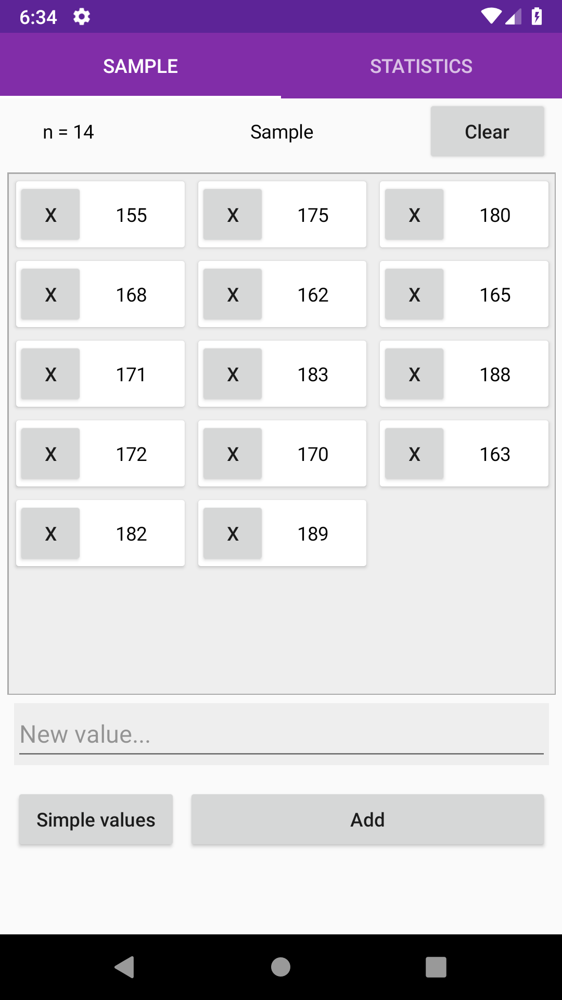

# Calculadora de estatística
> Aplicativo móvel de calculadora estatística

# Conteúdo
- [Motivação](#motivação)
- [Instalador](#instalador)
- [Funcionalidade](#funcionalidades)
- [Inicio rápido](#inicio-rápido)
- [Contribua](#contribua)
- [Classe Statistics](./StatisticsCore/)

# Motivação
Este aplicativo é parte do meu portfólio pessoal, portanto ficaria grato por feedbacks sobre o projeto, código, conceitos ou quaisquer outros aspectos. Outra motivação é que eu preciso de uma calculadora para à aula de estatística.

# Instalador
O instalador android (5.0 Lolipop até 9.0 Pie) pode ser encontrado [aqui](https://drive.google.com/open?id=1GyfaEhdp7MEbBXaw7EFToQjcOojnAKMX).

Quanto ao instalador iOS, sem previsão.

# Funcionalidades
- Soma de todos os valores da amostra
- Soma do quadrado dos valores da amostra
- Cálculo de média, mediana e moda
- Desvio padrão da amostra e da população
- Variancia da amostra e da população

A depender do andamento das minhas aulas de estatística e minha compreensão sobre o conteúdo, novas funcionalidades serão acrescentadas.

# Inicio rápido
## Requisitos
É necessário o Visual Studio junto do Xamarin instalados para rodar o projeto.
## Instalação
Clone o repositório: \
`$ git clone https://github.com/fernandovmp/statistics-calculator.git` \
Abra o arquivo `StatisticsCalculator.sln` localizado na raiz do projeto com o Visual Studio.

### HotReload
Para habilitar o HotReload do XAML siga os passos descritos [aqui](https://github.com/AndreiMisiukevich/HotReload).

### [A classe Statistics](./StatisticsCore/)

# Contribua
Para contribuir crie um fork do projeto e após as modificações faça um pull request. Qualquer contribuição é bem vinda.

O estilo de codificação é o mesmo de [.NET Foundation](https://github.com/dotnet/corefx/blob/master/Documentation/coding-guidelines/coding-style.md)

Em caso de encontrar alguma falha ou desejar discutir novas funcionalidades abra uma issue.
